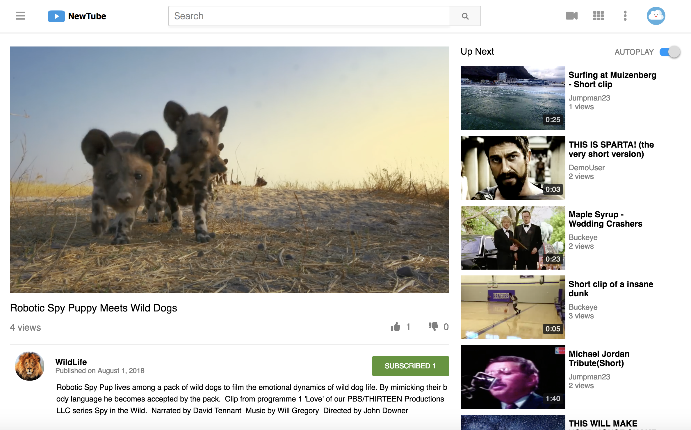

# NewTube
URL: [Live Link]()

NewTube, inspired by Youtube, is a single page video streaming web application. Functionality of NewTube includes uploading and watching videos, customizing your channel, searching for content, and interacting with the NewTubes content through comments, likes, subscriptions and more.

## Table of Contents
**Features**

* [User Authentication](#user-authentication)
* [Fluid Grid System](#fluid-grid-system)
* [Night Mode](#night-mode)
* [Navigation](#navigation)
* [Search](#search)
* [Video Index / Show / Upload](#video-index--show--upload)
* [Custom Video Player / Video Preview](#custom-video-player--video-preview)
* [Video Queue / Autoplay](#video-queue--autoplay)
* [Recursive Comments](#recursive-comments)
* [Likes(Polymorphic Association)](#likespolymorphic-association)
* [Subscriptions](#subscriptions)
* [Watch Later](#watch-later)
* [Filters](#filters)
* [Channels](#channels)
* [N + 1 Query Prevention](#n--1-query-prevention)

## Project Information
NewTube was developed utilizing Ruby on Rails, React.js with Redux, SASS, and AWS S3.

## User Authentication
On the back-end, an encrypted, hashed password is stored in the database (passwords are never saved to the database). On log-in, the provided password is rehashed and compared to the encrypted password in order to verify the log-in.

## Fluid Grid System
## Night Mode
## Search
## Video Index / Show / Upload
## Custom Video Player / Video Preview
## Custom Video Player / Video Preview
## Video Queue / Autoplay
## Recursive Comments
## Likes(Polymorphic Association)
## Subscriptions
## Watch Later
## Filters
## Channels
## Tags
## N + 1 Query Prevention
