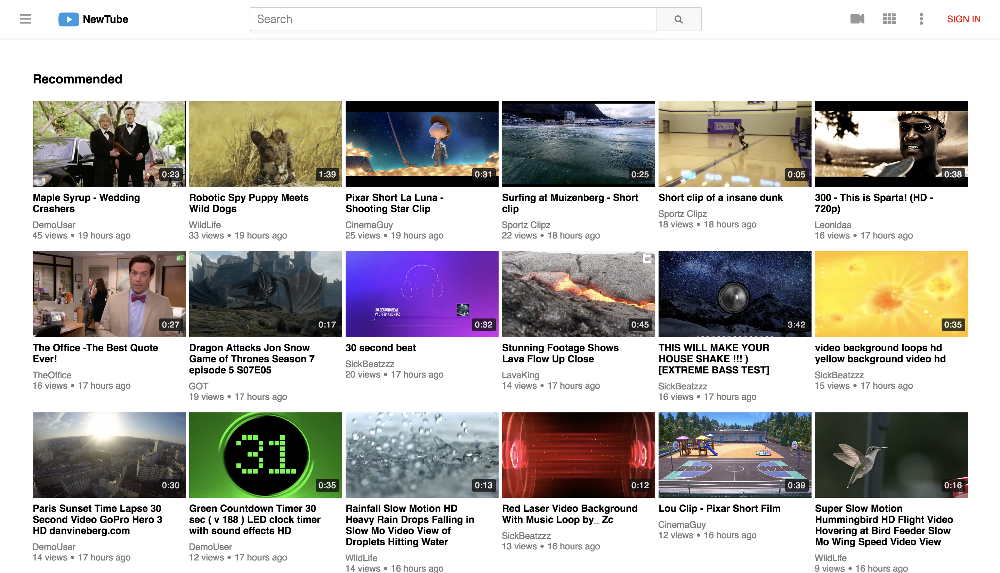
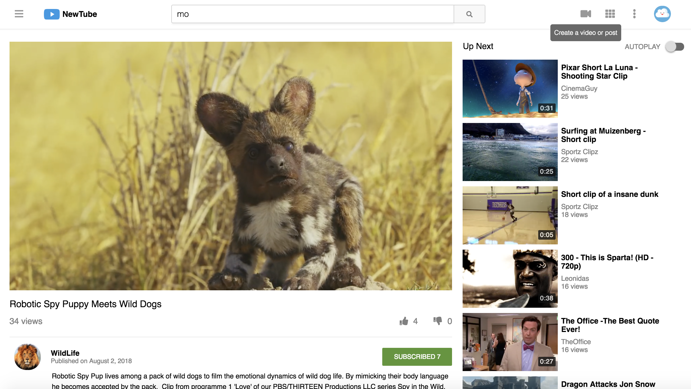
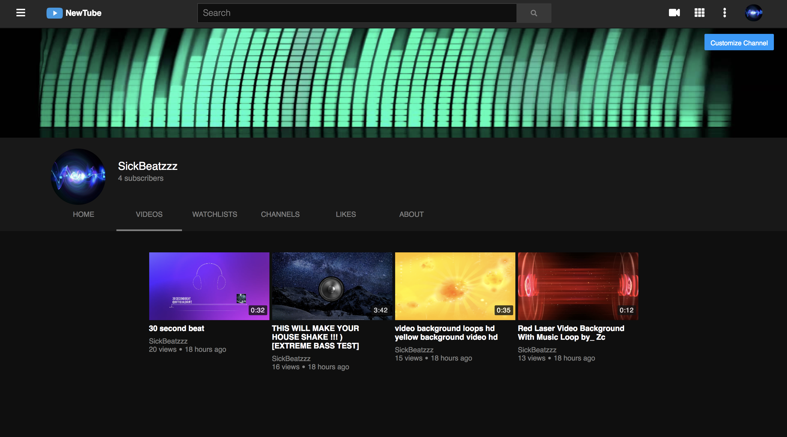
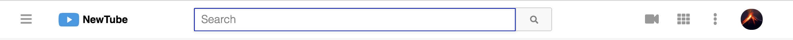
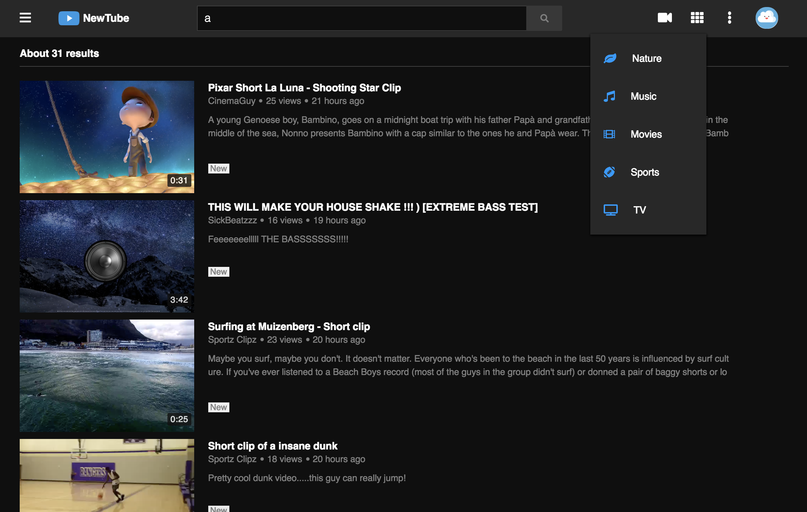
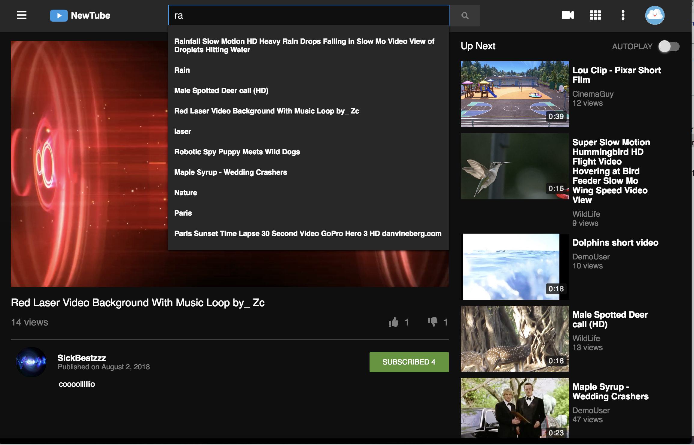
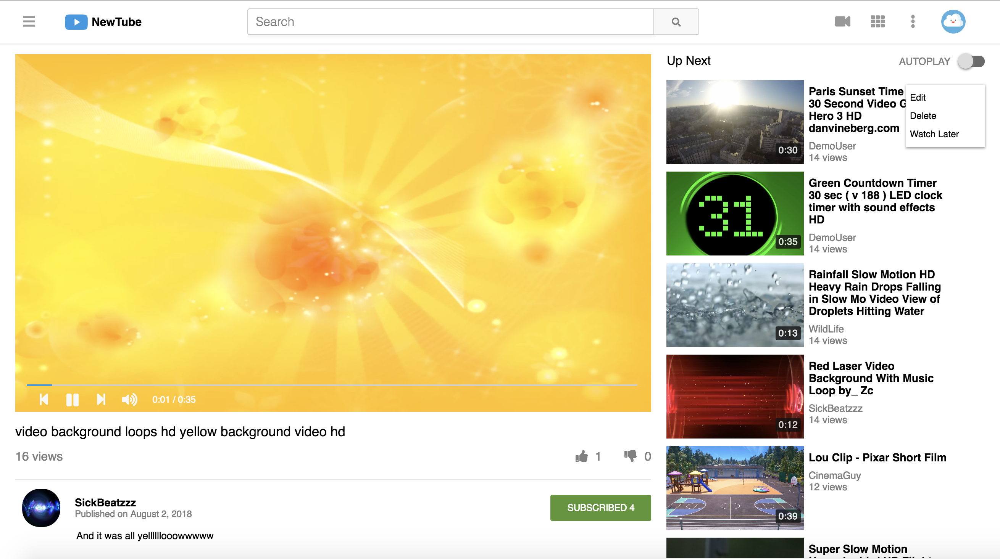
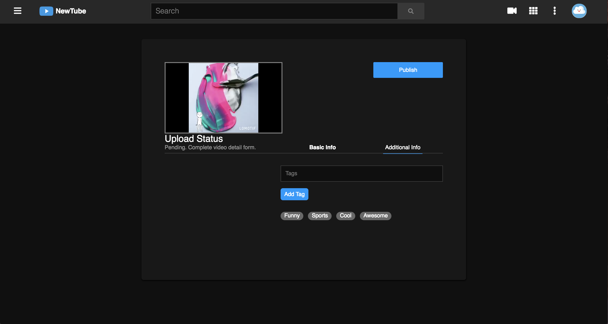
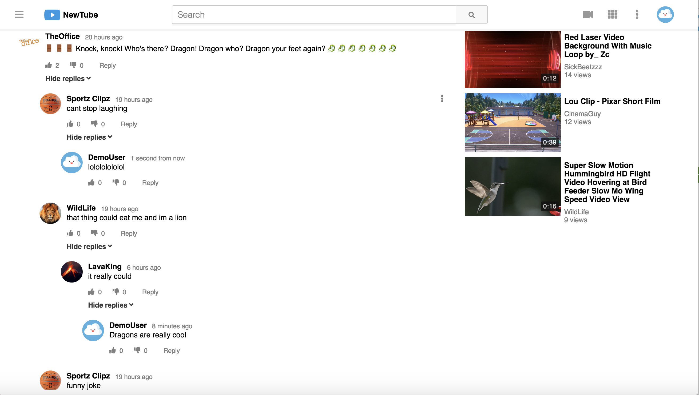

# NewTube
[Live Link](http://newtubeapp.herokuapp.com/)


NewTube, inspired by Youtube, is a single page video streaming web application. Functionality of NewTube includes uploading and watching videos, customizing your channel, searching for content, and interacting with the NewTubes content through comments, likes, subscriptions and more.

## Table of Contents
**Features**

* [User Authentication](#user-authentication)
* [Fluid Grid System](#fluid-grid-system)
* [Night Mode](#night-mode)
* [Navigation](#navigation)
* [Search](#search)
* [Video Index / Show / Upload](#video-index--show--upload)
* [Custom Video Player / Video Preview](#custom-video-player--video-preview)
* [Video Queue / Autoplay](#video-queue--autoplay)
* [Recursive Comments](#recursive-comments)
* [Likes(Polymorphic Association)](#likespolymorphic-association)
* [Subscriptions](#subscriptions)
* [Watch Later](#watch-later)
* [Filters](#filters)
* [Channels](#channels)
* [Tags](#tags)
* [N + 1 Query Prevention](#n--1-query-prevention)
* [Future Features](#n--1-query-prevention)

## Project Information
NewTube was developed utilizing Ruby on Rails, React.js with Redux, SASS, and AWS S3.

## User Authentication
Users can create and login to their personal channels.  Users provide a username (which must be unique) and a password of at least 6 characters.  Any errors with username or password will be communicated to users through error messages.

On the back-end, an encrypted, hashed password is stored in the database (passwords are never saved to the database). On log-in, the provided password is rehashed and compared to the encrypted password in order to verify the log-in.

NewTubes User Auth UI is implemented in a two step process.  Users first enter usernames.  An AJAX call is subsequently made, querying the users database for a user with the provided input.  Once the user is retrieved, users are greeted and asked for their password.  Finally, another AJAX call is made to the users table, where the hashed password is fetched given user input.


```javascript
processInput() {
  let path;
  let {verifyUsername, formType, receiveSessionErrors, processForm, clearSessionErrors}  = this.props;
  formType === "login" ? path = "/signin" : path = "/signup"
  if (!this.state.userVerified) {
    verifyUsername({username: this.state.username, path: path }).then(
      username => {
        clearSessionErrors()
        this.setState({userVerified: true});
      },
      errors => {
        receiveSessionErrors(errors.responseJSON);
      }
    )
  } else {
    if(this.state.reRoute === "/my_history") {
      processForm({username: this.state.username, password: this.state.password}).then(this.historyRedirect)
    } else if(this.props.history.action === 'REPLACE' || this.props.uploadRedirect) {
      processForm({username: this.state.username, password: this.state.password}).then(this.uploadRedirect)
    } else {
      processForm({username: this.state.username, password: this.state.password})
    }
  }
}
```

## Fluid Grid System
NewTube was designed to be fluid and viewable on all screen sizes, to allow for a clean interface and positive user experience.  This was accomplished using SASS, media queries as well as a fluid grid system.


```css
.col {
  float: left;
  box-sizing: border-box;
}

[class*='col-'] {
  padding-right: 20px;
  margin-top: 1.5rem;
}

[class*='col-']:last-of-type {
  padding-right: 20px;
}

.col-2-3 {
  width: 66.6666%;
  padding-left: 20px;
}

.col-1-3 {
  width: 33.3333%;
}

.col-1-2 {
  width: 50%;
  padding-left: 20px;
  padding-right: 20px;
}

.col-1-2-1 {
  width: 50%;
  margin-top: 0px;
}

@media all and (max-width: 1000px) {
  [class*='col-'] {
    width: 100%;
  }

  [class*='col-']:last-of-type {
    padding-left: 20px;
  }
}
```
Other CSS features includes tooltips, which allows users to hover over icons and get text info on functionality available to them.



## Night Mode


Every user has the option to change their viewing settings to night mode.  All channels start out with the traditional light colored UI, while a simple click will toggle to night mode, a dark themed UI perfect for viewing at night.  View settings are saved on the backend in the users database (resulting in changes persisting on refresh).  An onClick event listener is added to the settings li tag.  User view settings are passed down into the redux global state.  When the onClick event is fired, an edit user action is dispatched with the opposite view setting that the user currently possesses.  An AJAX request is then fired and changes the users view settings at the model level.


```javascript
toggleNightMode(e) {
  if(this.props.currentUser) {
    const formData = new FormData();
    formData.append("user[night_mode]", !this.state.nightMode);
    this.props.toggleNightMode(this.props.currentUser.id, formData).then(
      this.setState({nightMode: !this.state.nightMode})
    );
  } else {
    this.props.history.push('/signin')
  }

}
```

## Navigation

There are three ways to navigate through NewTube:
1. [Left Nav Side Bar Modal](#left-nav-side-bar-modal)
2. [Search](#search)
3. [Right Nav](#right-nav)

### Left Nav Side Bar Modal
The left nav features two main buttons (NewTubes logo, as well as a menu icon).  The NewTube logo button serves as a way to get back to the homepage.  Simply click the icon on any page within the app to return to the main index page.

The menu icon has more extensive functionality.  Once clicked, the menu icon dispatches an action to show or hide the side bar modal.  The side bar modal features four sub sections, each with different options for the user to use to explore NewTube.  The first section features home, trending and subscription links.  The second section (also known as the library), tracks the users viewing activity.  Users can look at their history, liked videos, uploads and watch laters.  The third section features all the channels the user is subscribed to. And finally, the last section (More from NewTube), includes additional filters for finding videos based on specific qualities.


The sidebar modal implementation was designed to be flexible and simple.  The modal component is available no matter what route the user is currently at.  The component has a switch statement to check the global redux state.  If the redux state indicates that the side bar should be shown (triggered by a user clicking on the menu icon and a subsequent action dispatch), then the component will be returned (null will be returned otherwise.)

```javascript
switch (modal) {
  case 'sidebar':
  component = <SideBar status={"open"} usersArr={usersArr}
    currentUserId={currentUserId} requestSubscriptions={requestSubscriptions}
    users={users} sideBarLink={sideBarLink} sideLink={sideLink}
    currentUser={currentUser} closeModal={closeModal} nightMode={nightMode}/>;
  break;
  default:
  return null;
}
```

### Right Nav

The right nav features four main options (upload, apps, settings, and profile).  The camera button allows users to upload videos / tags to NewTube through a form.  The apps icon displays a drop down menu list of the top five most popular apps (aka tags) on the application.  Settings allows users to toggle night mode, while the users avatar icon allows users to sign in, sign up, sign out and view their channel.

The drop down menu lists were implemented through a combination of local react state, as well as applying document event listeners.  When users click on the given icons, the event listener on the respective icon will call for the open app function to be called.  This function will set the local state of the component to display the drop down items, while also giving the entire document an onClick event to listen for.  Once the user clicks anywhere outside of the dropdown, the drop down list closes and the event listener is removed from the document.

```javascript
appDropDown(e) {
  e.preventDefault();
  this.setState({ appsDropDown: true }, () => {
  document.addEventListener('click', this.closeApp);
  });
}

closeApp(e) {
  e.preventDefault();
  this.setState({ appsDropDown: false }, () => {
    document.removeEventListener('click', this.closeApp);
  });
}
```

## Search

Users have the ability to search for videos, channels and tags through NewTubes custom search feature.  The search feature was developed using both the frontend and backend working together.  On the front end, users type in their input.  To keep the search fast and minimize unnecessary database queries, the component makes use of debouncing to only send AJAX requests after no letters have been typed for 300 milliseconds.  

Once the AJAX request has been fired, it hits the search controller.  Videos, users and tags are searched for in each respective database that meet the params requirements of including the search input.  The found items are then sent back down the redux state into the search component.  Each item is then ranked based on similarity to the users input using the Levenshtein distance.  Levenshtein distance between two words is the minimum number of single-character edits (insertions, deletions or substitutions) required to change one word into the other).

```ruby
class Api::SearchController < ApplicationController
  def index
    @videos = Video.where("lower(title) LIKE ?", "%#{params[:query].downcase}%" )
    @users  = User.where("lower(username) LIKE ?", "%#{params[:query].downcase}%")
    @tags  = Tag.where("lower(name) LIKE ?", "%#{params[:query].downcase}%")
    if params[:query] === ""
      render json: ["Invalid search"], status: 401
    else
      if @videos || @users || @tags
        render 'api/search/index'
      else
        render json: ["Invalid search"], status: 401
      end
    end
  end
end
```
```javascript
similarity(a, b) {
  if(a.length == 0) return b.length;
  if(b.length == 0) return a.length;

  var matrix = [];

  var i;
  for(i = 0; i <= b.length; i++){
    matrix[i] = [i];
  }

  var j;
  for(j = 0; j <= a.length; j++){
    matrix[0][j] = j;
  }

  for(i = 1; i <= b.length; i++){
    for(j = 1; j <= a.length; j++){
      if(b.charAt(i-1) == a.charAt(j-1)){
        matrix[i][j] = matrix[i-1][j-1];
      } else {
        matrix[i][j] = Math.min(matrix[i-1][j-1] + 1,
                                Math.min(matrix[i][j-1] + 1,
                                         matrix[i-1][j] + 1));
      }
    }
  }

  return matrix[b.length][a.length];

}
```

## Video Index / Show / Upload
NewTube features a video index (homepage), video show (individual video page), and upload option to users.  Any video that you upload, you will have the option to edit, delete, or watch later from any player within the application. If you did not upload the video, you will only have to ability to watch later, or like the video.



Video upload allows users to upload content to NewTube.  Each video can be uploaded with a title, description and tag.  Once the user publishes the video, a spinner loader is dispatched to let the user know their publish is being processed.



## Custom Video Player / Video Preview
NewTubes video show page features a custom built video player, built using the HTML5 video API.  The video player has the ability to play and pause videos, select the previous and next videos, as well as toggle volume.  


The video player waits for the video to be loaded into the video HTML tag.  Once loaded, the player listens for clicks and pauses or plays the video depending on the global redux state.  Volume is implemented the same way.  Time is implemented by having an onTimeUpdate listener attached to the video tag.  Each time this listener is called the local states currentTime variable is set to the videos currentTime.  This allows for the seconds to tick as the video is played.

```javascript
togglePlay(e) {
  let video = document.getElementById('vid-player')
  if (this.props.vidPlaying) {
    this.setState({videoPlaying: false})
    this.props.vPlaying(false);
    video.pause();
 } else {
    this.props.vPlaying(true);
    this.setState({videoPlaying: true})
    video.play();
 }
}

tick(e){
  this.getCurrentTime(e)
  this.setState({currentTimeNum: e.currentTarget.currentTime, durationNum: e.currentTarget.duration})
}
```

Every video outside of the main video show player, allows a hover preview of the respective video.  This was implemented through having a mouse enter event listener that then triggers the video to play for four seconds.  Once four seconds is up, the current time of the video is reset to 0 and the video is paused.  


```javascript
preview(e) {
  let video = e.currentTarget.children[0].children['video']
  video.muted = true;
  let playPromise = video.play();
  if (playPromise !== undefined) {
  playPromise.then(_ => {
    this.setState({preview: true, showTime: false})
  })
  .catch(error => {
    return null
  });
}
}

closePreview(e) {
  let video = e.currentTarget.children[0].children['video']
  video.pause()
  this.setState({preview: false, currentTime: 0, playButton: false, showTime: true})
  video.currentTime = 0
}

tick(e) {
  let video = e.currentTarget;
  this.setState({currentTime: video.currentTime})
  if(this.state.currentTime >= 4) {
    this.resetPreview(e);
  }
}
```
## Video Queue / Autoplay
NewTubes autoplay allows users to lazily watch content without having to select videos on play end.  Users can simply toggle the autoplay button at the top right of the video show page above the related video side bar section.  Each user has an autoplay column in the users model.  Similar to night mode, autoplay is toggled through the use of event listeners and AJAX calls, to allow autoplay to persist on refresh.

The global redux state keeps an array of the current video queue.  Once a video ends, the video queue indexes the next video to be played, and pushes the history to that respective video show page.

```javascript
handleEnd(e) {
  if(this.props.autoplay) {
    let currentIdx = this.props.videoQueue.indexOf(this.props.video.id)
    let nextIdx = (this.props.videoQueue.indexOf(this.props.video.id) + 1) > (this.props.videoQueue.length - 1) ? 0 : (this.props.videoQueue.indexOf(this.props.video.id) + 1)
    let nextVidId = this.props.videoHash[this.props.videoQueue[nextIdx]].id
    this.props.history.push(`/video/${nextVidId}`)
  }
}
```

## Recursive Comments

Users have the ability to comment on videos, as well as reply to other comments recursively, allowing for deep nested comments.  Users can then hide or expand comment replies if they so choose.  Additionally, all authored comments can be updated or deleted.  Implementing recursive comments was done by setting up the schema of comments to include parent_id.  All top level comments have parent_id of null, while all nested comments have a parent_id.

When rendering the comments, all top level comments are first fetched.  I then iterate over the top level comments, recursively passing in the comment component for all of its children.

```html
<ul className={this.state.showReplies ? "" : "hidden"}>
  {child_comments.length > 0 ? child_comments.reverse().map((child,idx) => <CommentIndexItemContainer key={idx} createComment={createComment} currentUser={currentUser} user={users[child.author_id]} users={users} comment={child}/>) : null}
</ul>
 ```

Comments can be sorted based on most recent or by like count.  This is implemented using mergesort.   
## Likes(Polymorphic Association)
## Subscriptions
## Watch Later
## Filters
## Channels
## Tags
## N + 1 Query Prevention
